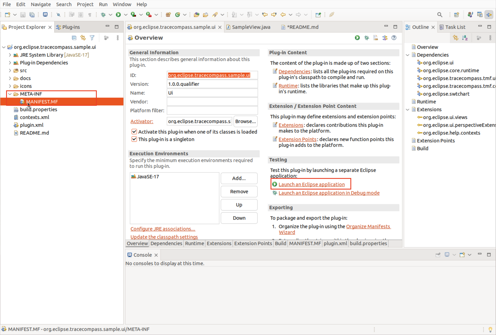
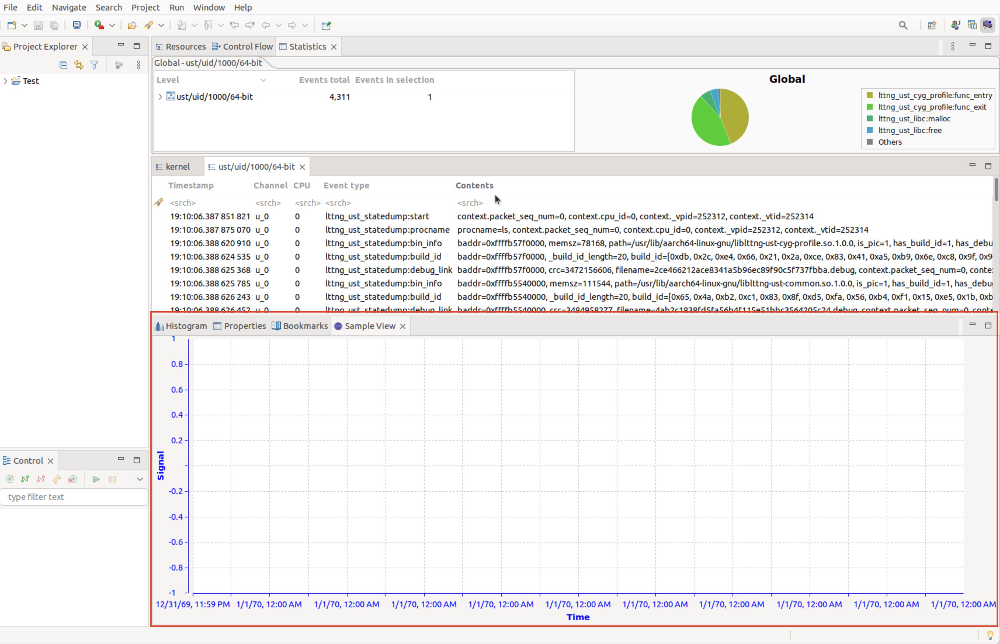

# Trace Compass Plug-In: Sample View

This is my first attempt at creating a Trace Compass plug-in. It adds a sample view to the tracing perspective.

This project was created by roughly following the [Trace Compass Development Guide: View Tutorial](https://rtist.hcldoc.com/help/index.jsp?topic=%2Forg.eclipse.tracecompass.doc.dev%2Fdoc%2FView-Tutorial.html).

## Instructions

1. Open the project in Eclipse.
2. Open the "MANIFEST.MF" file.
3. Click "Launch an Eclipse application" under "testing".

## How to test

After launching the Eclipse application, it will open another instance of Eclipse. Perform these next steps in the new Eclipse window.

1. Create a new tracing project.
2. Go to "Window" > "Perspective" > "Open Perspective" > "Other" from the main menu.
3. Choose "Tracing" from the presented options and click "Open".
4. Go to "Window" > "Show View" > "Other" from the main menu.
5. Choose "Sample Category > Sample View" from the presented options and click open. 
6. You should now see the "Sample View" plug-in.

